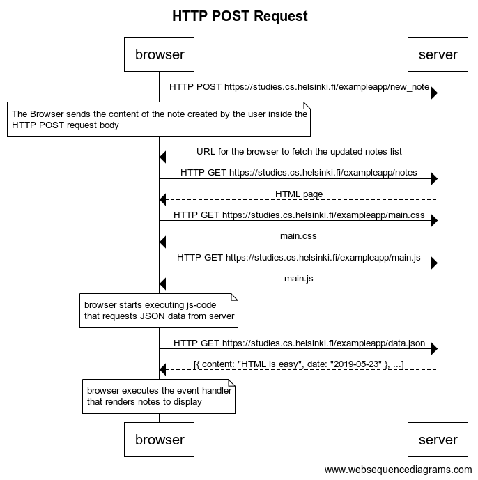

# Excercise 0.4

**Code**
```
title HTTP POST Request

browser->server: HTTP POST https://studies.cs.helsinki.fi/exampleapp/new_note

note over browser:
The Browser sends the content of the note created by the user inside the
HTTP POST request body in JSON format
end note

server-->browser: URL for the browser to fetch the updated notes list
browser->server: HTTP GET https://studies.cs.helsinki.fi/exampleapp/notes
server-->browser: HTML page
browser->server: HTTP GET https://studies.cs.helsinki.fi/exampleapp/main.css
server-->browser: main.css
browser->server: HTTP GET https://studies.cs.helsinki.fi/exampleapp/main.js
server-->browser: main.js

note over browser:
browser starts executing js-code
that requests JSON data from server 
end note

browser->server: HTTP GET https://studies.cs.helsinki.fi/exampleapp/data.json
server-->browser: [{ content: "HTML is easy", date: "2019-05-23" }, ...]

note over browser:
browser executes the event handler
that renders notes to display
end note
```

**Result**

