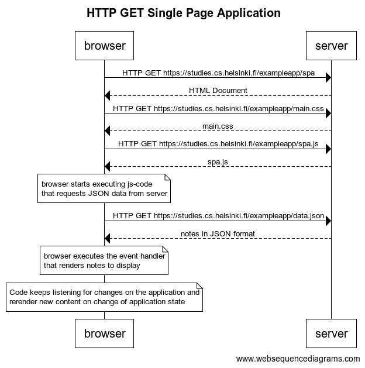

# Excercise 0.5

**Code**
```
title HTTP GET Single Page Application

browser->server: HTTP GET https://studies.cs.helsinki.fi/exampleapp/spa
server-->browser: HTML Document
browser->server: HTTP GET https://studies.cs.helsinki.fi/exampleapp/main.css
server-->browser: main.css
browser->server: HTTP GET https://studies.cs.helsinki.fi/exampleapp/spa.js
server-->browser: spa.js

note over browser:
browser starts executing js-code
that requests JSON data from server
end note

browser->server: HTTP GET https://studies.cs.helsinki.fi/exampleapp/data.json
server-->browser: notes in JSON format

note over browser:
browser executes the event handler
that renders notes to display
end note

note over browser:
Code keeps listening for changes on the application and 
rerender new content on change of application state
end note
```

**Result**

