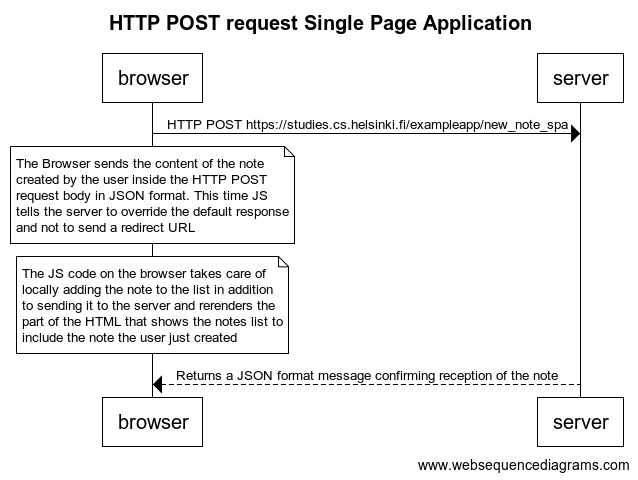

# Excercise 0.6

**Code**
```
title HTTP POST request Single Page Application

browser->server: HTTP POST https://studies.cs.helsinki.fi/exampleapp/new_note_spa

note over browser:
The Browser sends the content of the note
created by the user inside the HTTP POST
request body in JSON format. This time JS
tells the server to override the default response
and not to send a redirect URL
end note

note over browser:
The JS code on the browser takes care of
locally adding the note to the list in addition
to sending it to the server and rerenders the
part of the HTML that shows the notes list to
include the note the user just created
end note

server-->browser: Returns a JSON format message confirming reception of the note
```

**Result**

